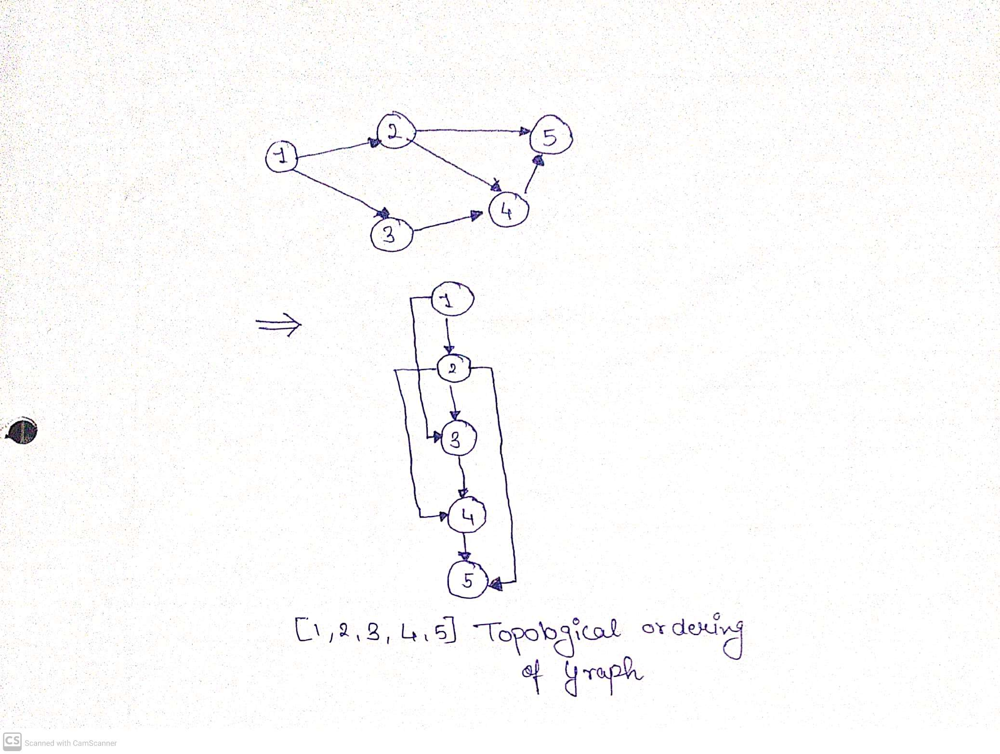
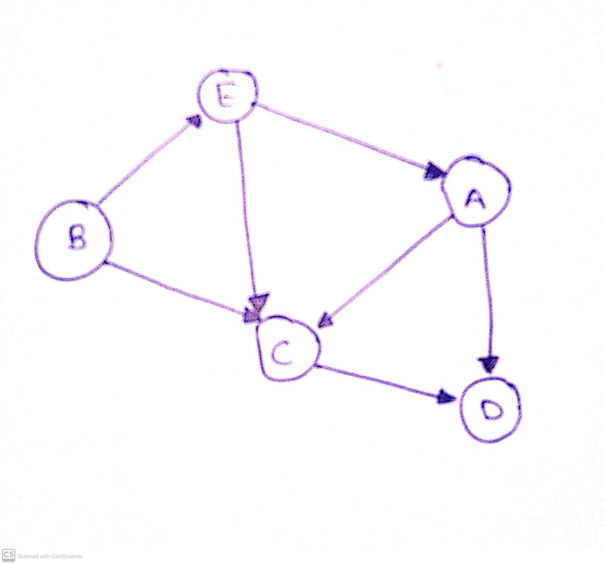
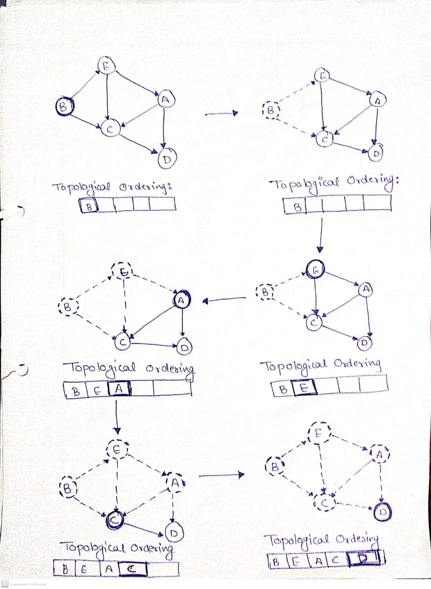

# Topological Sorting

Created: November 28, 2022 10:05 PM

# INTRODUCTION

The **topological sort** algorithm takes a directed graph and returns a vector of the nodes where each node appears *before* all the nodes it points to.

A topological sort or topological ordering of a directed graph is a linear ordering of its vertices in which u occurs before v in the ordering for every directed edge uv from vertex u to vertex v. For example, the graph's vertices could represent jobs to be completed, and the edges could reflect requirements that one work must be completed before another.

In this case, a topological ordering is just a legitimate task sequence. A topological sort is a graph traversal in which each node v is only visited after all of its dependencies have been visited. If the graph contains no directed cycles, then it is a directed acyclic graph. Any DAG has at least one topological ordering, and there exist techniques for building topological orderings in linear time for any DAG.

# Example



# Algorithm



```
topological_sort(N, adj[N][N])
        T = []
        visited = []
        in_degree = []
        for i = 0 to N
                in_degree[i] = visited[i] = 0

        for i = 0 to N
                for j = 0 to N
                        if adj[i][j] is TRUE
                                in_degree[j] = in_degree[j] + 1

        for i = 0 to N
                if in_degree[i] is 0
                        enqueue(Queue, i)
                        visited[i] = TRUE

        while Queue is not Empty
                vertex = get_front(Queue)
                dequeue(Queue)
                T.append(vertex)
                for j = 0 to N
                        if adj[vertex][j] is TRUE and visited[j] is FALSE
                                in_degree[j] = in_degree[j] - 1
                                if in_degree[j] is 0
                                        enqueue(Queue, j)
                                        visited[j] = TRUE
        return T
```

Once a node is added to the topological ordering, we can take the node, and its outgoing edges, out of the graph.

This is a common algorithm design pattern:

1. Figure out how to get the *first* thing.
2. Remove the first thing from the problem.
3. Repeat.

We'll grab a node with an indegree of 0, add it to our topological ordering and remove it from the graph:



## ****Time and Space Complexity****

### → T**ime complexity is O(M+N)**

### → S**pace complexity: O(N)**

# Applications

1. Finding cycle in a graph
2. Operation System deadlock detection
3. Dependency resolution
4. Sentence Ordering
5. Critical Path Analysis
6. Course Schedule problem
7. Other applications like manufacturing workflows, data serialization and context-free grammar
